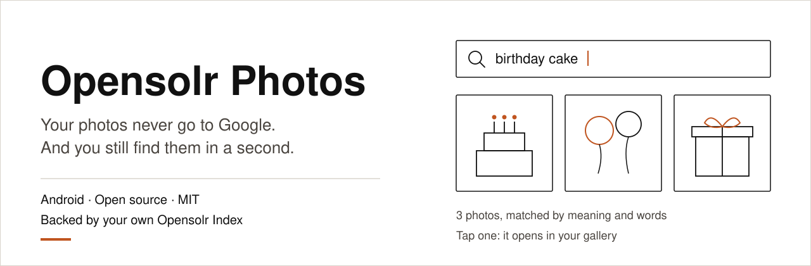

<p align="center">
  
</p>

# Opensolr Photos

**Find any photo on your phone by what is in it.**

Opensolr Photos is a free, open source Android app that turns the photo folders on your phone into a
search engine. Type *dog on the beach*, *birthday cake* or *snow in the mountains*, narrow it down by year,
folder, camera, city or country, see them on a map, and tap a result to open it in Google Photos or your
phone's own gallery.

The search engine behind it is **your own Opensolr Index**, created by the app in your Opensolr account,
one per phone. No photo backup, no Google account, no ads, no analytics.

**[Download the APK](https://github.com/phpcip/opensolr-photos/releases/latest/download/opensolr-photos.apk)** ·
[Website](https://opensolr.com/opensolr-photos) ·
[Documentation](https://opensolr.com/opensolr-photos-docs) ·
[Releases](https://github.com/phpcip/opensolr-photos/releases)

---

## What it does

| | |
|---|---|
| **The index, on the phone** | The phone keeps its own copy of every document its index holds: id, path, file name, size, dates, camera, EXIF, place, the words the photo was read into, the printed text, the people, your tags and the file's md5. Only the search vector and the duplicate keys stay behind. It is read from the index once, at install or reinstall, and every write keeps it in step. |
| **Search by meaning** | On a plan with vector search, every photo is read into words describing what it shows, and your query is matched on meaning too, so *puppy* finds the photos read as *dog*. |
| **Search the text in your photos** | Receipts, invoices, shelf labels, screenshots, business cards: on a plan with vector search, the words printed in a photo are read on Opensolr's side and become searchable. A petrol receipt is found by the station, the total or its number. Only photos that carry text are read, and it costs no more than any other photo. |
| **Filters** | Year, taken between two days, people, your own tags, meaning, camera model, city, country, orientation, a radius around a point, and switches for photos with printed text, tagged, with people and with a location. The filter values come from your own photos and are listed alphabetically. Every group carries the same heading as the grid, folds away (all folded to start with), is remembered between visits, and shows a badge with how many of its own filters are on. Choosing years narrows the *Taken between* calendar to those years and opens it there; choosing days puts the years aside. |
| **Best matches first** | A typed search splits its results into *Best matches* and *Also similar*. Browsing without a query has three levels, Year, then Month, then Day, with Today, Yesterday and the last few days above the years. Every month is spelled out by its days, even a month with a single day, and group headings fold and are remembered. |
| **Selecting photos** | A long press starts a selection and it ends by itself when the last tick goes. A tick on a group heading takes the whole group, a year, a month or a day, not only the photos loaded on screen. In a typed search, *Best matches* and *Also similar* have no group tick: their boundary moves as more results arrive. |
| **Your own tags and words** | Tag the selected photos: People first, then *My tags (Albums)*, each with an Add / Replace switch. Add puts your words on top of what each photo carries; Replace makes them the whole of that field on every ticked photo, and says so. Under the form, what the ticked photos already carry, with counts. Saving is finished on the phone; the sync that starts straight after carries the change up. Your words always win over what Opensolr saw. Writing them into the photo files themselves happens on the spot, with Android's permission dialog and a progress bar, and a photo with no date of its own keeps the date the index has for it instead of jumping to today. |
| **Autocomplete and spelling** | As you type in the search box, your tags, the words your photos were read into, the cameras and the places are offered by the index, and the same prefix typed again is answered from the phone; a misspelt search gets a *Did you mean*. In the tagging sheet, the tags and the names offered come from the phone's own copy, without a request. |
| **Albums** | People, My tags, Things, Places, Cameras and Years, built from your index in one request, each album with a cover of its three newest photos. |
| **Duplicates** | A slider from *Same first word* to *Same photo (EXIF)*, *Same file name* and *Same file size* groups alike photos; *Select 1 of each duplicate* ticks them for review, sharing or deleting. |
| **Delete** | Delete selected photos from the phone and the index at once, after the app's own warning (and Android's, on Android 11 and newer). |
| **A map** | Every photo with a GPS position, grouped into thumbnail markers on OpenStreetMap. Tap a group and its photos open straight away, in a sheet that drags up to the whole screen and says where *here* is, in city and country; or *Search this area*. The night map is dimmed rather than colour-inverted, so the sea stays blue. The place is written into the index in words (city, region, country). |
| **Opens in your gallery** | Tap a result: it opens in Google Photos or your phone's gallery app. Its details show the people first, as chips, then *My tags (Albums)*, then what the photo shows, as plain text. |
| **Keeps itself in step** | A sync runs on its own a minute after photos change in the folders you chose (a screenshot elsewhere costs nothing); a daily, weekly or monthly Re-Sync stands behind it, and Force Re-Sync is one tap away. Pulling the grid down reloads it and starts a sync too, unless one is already running. The sync no longer walks the index: it compares your folders with the phone's copy, on the phone, so a sync with nothing to do makes no request at all (before 2.5, about 21 requests and ~1.8 MB every time, for a library of 10,000 photos). New photos are added, edited photos are read again, deleted photos leave the index, and you can pick photos to have them read again. The printed text and the words already read out of a photo are kept when a later pass cannot read it, as long as it is the same file, checked by its md5. |
| **Tells you about new versions** | Once a day the app looks at the latest release on GitHub. A newer one shows up on the Photos screen with what is new and a Download button; nothing is installed behind your back. The account screen shows the version you are running and checks on demand, and says so plainly when it cannot reach GitHub. |
| **One index per phone** | `photos_<ANDROID_ID>__dense` in your Opensolr account. Reinstall on the same phone and it finds its index again. |
| **Plan limits, in plain numbers** | Right after sign-in, and on the account screen: photos per month, disk space, search bandwidth, and where to upgrade. |
| **Spends less of your bandwidth** | A sync with nothing to do, all plain browsing (the years, the months, the days, their counts and the photos in them), the tag and name suggestions and the *already on these photos* list in the tagging sheet are answered from the phone's copy and cost nothing. The filter lists are asked for once and kept until a sync actually writes something. What is left, a typed search and a filtered view, is kept on the phone and reused for as long as you choose (at least a minute), so asking the same thing twice does not spend your plan's search bandwidth twice. Swiping down reloads the grid and starts a sync. |

## How it works

<p align="center">
  
</p>

1. **Sign in** with your Opensolr account, in the phone's browser ([sign-in](docs/sign-in.md)).
2. **Pick folders.** DCIM, where the camera saves, is proposed.
3. **The app sets up this phone's index**: creates it if it does not exist and uploads the
   [schema](docs/index-schema.md) that ships in [`solr/conf`](solr/conf).
4. **The app reads the index into the phone, once.** At install, and again after a reinstall, every
   document the index holds is read down into the phone's own copy, everything but the search vector
   and the duplicate keys. From then on the copy is kept in step by every write, and the index is not
   read whole again.
5. **Sync.** The app compares the folders you chose with its own copy, on the phone, without asking the
   index anything. For every photo the copy does not have, it makes a 640 px copy carrying the original's
   EXIF and hands it, five at a time, to Opensolr's `photos_ingest` endpoint, together with the names of
   any people already written on the file, and your tags and words for it when this phone has them. The server does the rest: reads the EXIF, asks CLIP what the
   photo shows, turns those words into a search vector, reads the text printed in the photo when CLIP says
   there is any, turns the GPS position into a place, keeps the tags and words already in the index, and
   writes the complete document into your index itself. The phone's part ends with the upload
   ([sync](docs/sync.md)).
6. **Words you changed go up on their own.** Tags, names and wording are saved on the phone and finished
   there; the same sync carries them to the `photos_words` endpoint, 50 photos per call, with no pictures
   attached, because only the words changed.
7. **Search.** A typed query or a filtered view goes to the index through Opensolr's `{!hybrid}` parser:
   words and meaning blended, filters, spelling, the map, albums and duplicates ([search](docs/search.md),
   [map](docs/map.md), [albums](docs/albums.md), [duplicates](docs/duplicates.md)). Plain browsing, and the
   tags and names offered while tagging, never leave the phone.

## Requirements

- Android 8.0 (API 26) or newer.
- An [Opensolr](https://opensolr.com) account. [Create one](https://opensolr.com/register).
- For search by meaning: a plan that includes vector search. Without it nothing is sent to be read at all:
  photos are indexed by date, camera, place, file name and your own words, and search is lexical over those.
- Ten new photos use one AI request of your plan. Photos already indexed never cost anything again;
  changing tags, names or wording goes up 50 photos per call with one embedding for the whole batch, so the
  photos themselves cost nothing. Details: [plan limits](docs/plan-limits.md).

## Install

1. On your phone, download
   [opensolr-photos.apk](https://github.com/phpcip/opensolr-photos/releases/latest/download/opensolr-photos.apk).
2. Allow your browser to install it when Android asks.
3. Open **Opensolr Photos**, sign in, pick your folders. The first sync starts on its own.
4. **Xiaomi, Redmi, POCO, Huawei, OnePlus, Oppo, Vivo:** these phones stop background apps to save
   battery, which stops a sync halfway. Open the phone's settings for the app, set battery to
   **No restrictions** (Xiaomi: *Battery saver* → *No restrictions*, and turn on *Autostart*). The sync
   resumes where it stopped, so nothing is lost, but without this it only advances while the app is open.

The APK is signed with the Opensolr Photos release key. SHA-256 of the signing certificate:

```
1A:54:DA:CE:0D:5D:7E:80:DF:76:D7:A2:87:AB:3F:DB:C4:B9:CE:7C:EF:9C:17:2E:32:91:59:37:3A:19:41:51
```

## Your data

<p align="center">
  
</p>

- **Originals never leave the phone.** Only a 640 px re-encoded copy is sent to be indexed, carrying the
  original's EXIF (time, camera, position) and the names of any people already written on the file; the copy is processed in memory and
  not stored. The position, rounded, is turned into a place name on the server.
- **The map** draws OpenStreetMap tiles, requested only while the map screen is open. That is the only
  host besides Opensolr the app ever talks to.
- **The index is yours**: labels, a search vector, date, camera, place, path, file name, size, the dates,
  the EXIF, the text printed in the photo, the people, your own tags and the file's md5. It lives in your
  Opensolr account, you can see it, back it up or empty it in the Opensolr control panel.
- **A copy of it sits on the phone.** Every document of your index, field for field, except the search
  vector and the duplicate keys, which the phone has no use for. It is what makes browsing, suggestions
  and an idle sync free of requests. It goes when the app does.
- **Your password is only ever typed into the browser.** The app stores the account API key encrypted with
  an Android Keystore key, and excludes its data from phone backups.

Full account: [privacy and security](docs/privacy-and-security.md).

## Documentation

| Page | What is in it |
|---|---|
| [How it works](docs/how-it-works.md) | The whole picture, component by component |
| [Sign-in](docs/sign-in.md) | OAuth 2.0 with PKCE, step by step, and what is checked where |
| [Sync and Re-Sync](docs/sync.md) | The algorithm, the ids, the schedule, index recreation, limits |
| [Search](docs/search.md) | The header, how a query is built, grouping, filters, autocomplete, spelling, deleting, editing tags |
| [Map](docs/map.md) | Markers, groups, Search this area, what the map sends |
| [Albums](docs/albums.md) | The sections, the one facet request, covers and names |
| [Duplicates](docs/duplicates.md) | The 13 slider stops, the keys behind them, Select 1 of each duplicate |
| [Index schema](docs/index-schema.md) | Every field, the analyzers, the vector field, the duplicate keys, the configset |
| [Plan limits](docs/plan-limits.md) | What counts against your plan and what the app does at a limit |
| [Privacy and security](docs/privacy-and-security.md) | Data flows, storage, network, threat model |
| [Project structure](docs/project-structure.md) | A developer tour: every folder, every package, where to change what |
| [Building from source](docs/building.md) | Toolchain, signing, debug builds |
| [Contributing](CONTRIBUTING.md) | How changes get in, conventions, and how to become a contributor |
| [Troubleshooting](docs/troubleshooting.md) | Common situations and what to do |

## Build from source

```bash
git clone https://github.com/phpcip/opensolr-photos.git
cd opensolr-photos
./gradlew assembleDebug
```

JDK 17 or newer and the Android SDK (platform 36) are needed. Release builds and signing:
[building](docs/building.md).

## Project layout

```
app/src/main/java/com/opensolr/photos/
  auth/     browser sign-in (PKCE) and the callback activity
  data/     preferences, Keystore encryption, the phone's copy of the index, models
  index/    finding, creating and setting up the phone's index
  media/    MediaStore scanning, EXIF, the 640 px copy
  net/      Opensolr REST API and direct Solr client
  search/   query building, albums, duplicates, tag edits and result parsing
  sync/     the sync engine, WorkManager worker, schedule, notifications
  ui/       Jetpack Compose screens and theme
solr/conf/  schema.xml, solrconfig.xml and analyzer files uploaded to the index
docs/       documentation and diagrams
```

## Tools used

Claude (Anthropic) was used while building this app, in three ways: automation testing (building the APK,
installing it in the Android emulator over adb, driving the screens and taking screenshots so results could
be checked), very little of the actual code, and a lot of the documentation, generated from the developer's
notes. The product, the architecture, the sync algorithm, the Solr configset and the Opensolr server side
are the developer's own work, and every build is tested on real phones. The tool gets no credit lines in
commits or source: a tool is not a contributor.

## License

[MIT](LICENSE) © Opensolr SRL. Space Grotesk font: SIL Open Font License, see
[third_party/space-grotesk/OFL.txt](third_party/space-grotesk/OFL.txt).

Security issues: see [SECURITY.md](SECURITY.md).
