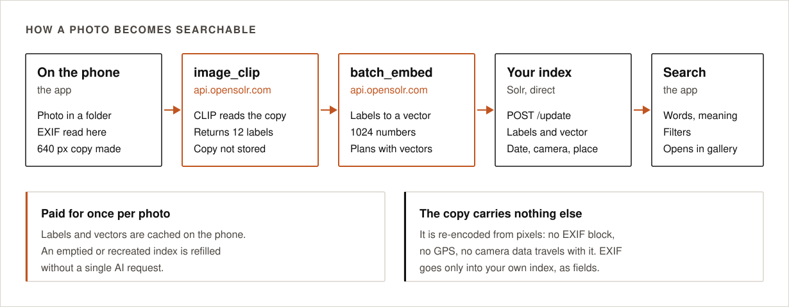
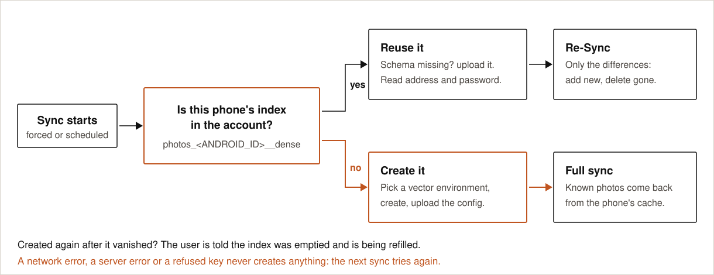

# How it works

  

Opensolr Photos has four moving parts: the app on the phone, the phone's own copy of the index, the
Opensolr platform, and the phone's Opensolr Index. The app talks to each remote part over HTTPS and to
nothing else.

## The parts

### The app

- Finds photos through Android's MediaStore, in the folders you chose (DCIM by default).
- Reads each photo's EXIF metadata itself: date, camera, lens, exposure, place.
- Makes a small upright JPEG copy (640 px on the long edge) for the reader. The copy is re-encoded from
  pixels, so it carries no metadata. Without vector search on the plan nothing is read from it.
- Reads the photo's own facts from the file: its EXIF, and the names of the people in it when something has
  already written them there (`PersonInImage` in XMP).
- Reads from the phone's own copy of the index first. Browsing, the counts, the suggestions and the
  document read back before an edit never reach the index. Writes still go to the index, and a typed search
  still goes straight to it.
- Saves your tags, names and wording on the phone and is done with them there; the sync that starts
  straight after carries them up. Writing those words into the photo files themselves (XMP) is a separate
  step that happens on the spot, with Android's permission dialog and a progress bar.
- Runs sync in the background with WorkManager, one sync at a time, and watches MediaStore so a sync runs
  on its own when photos change. Pulling the grid down also reloads and starts a sync, ignored when one is
  already running.
- Draws the map with osmdroid on OpenStreetMap tiles. Besides Opensolr, those tiles and `api.github.com`
  (the update check) are the only hosts it ever contacts.
- Keeps the answers the index did give and reuses them for as long as you set on the account screen, so a
  repeated question costs no bandwidth. Reads only. See [the search cache](search.md#search-cache).

### The phone's copy of the index

The phone holds a copy of every document its index holds, in SQLite (`photo_cache.db`, the `docs` table).
Everything is in it except the search vector and the [duplicate keys](duplicates.md): the id, the path, the
file name, the size, the dates, the camera, the EXIF, the place, the words the photo was read into, the
printed text (OCR), the people, your own tags, and the md5 of the file. The exact field list is
`EditRepository.CLONE_FIELDS`.

It is read from the index **once** — at install, at reinstall, or after a reset — and from then on every
write keeps it in step: each `photos_ingest` and each `photos_words` answer goes straight into it.

What that takes off the wire:

- **Syncing no longer walks the index.** The comparison is between your folders and the copy, both already
  on the phone, so a sync with nothing to do reads no documents from the index at all — all a quiet run
  still asks is the short checks it opens with: that the index is still in your account, that it is still on
  the configuration this version expects, and what your plan allows today. Before 2.5 a library of 10,000
  photos cost about 21 requests and about 1.8 MB on every single sync, only to find nothing had changed.
  See [sync](sync.md).
- **Plain browsing makes no request.** The years, the months, the days, their counts and the photos inside
  them all come from the copy.
- **Tag and name suggestions**, and the *already on these photos* list under the tagging sheet, are
  answered from the copy.
- **The filter lists** are asked for once and then kept until a sync actually writes something.

### opensolr.com

Account and index management:

- the sign-in pages (`/app/authorize`) and the code exchange (`/app/token`), see [sign-in](sign-in.md);
- creating the index, uploading its configuration, reading its address and password, plan limits;
- `nearby_places`: up to 50 GPS positions in, the nearest named place of each out (city, region, province,
  community, country), answered from a permanent store so a position is looked up once for everyone.

### api.opensolr.com

The AI endpoints:

- `photos_ingest` takes up to five photos at once and indexes them completely on the server: EXIF from
  the copy, the words CLIP sees (`openai/clip-vit-large-patch14` against a vocabulary of about 51,000
  labels, with the ImageNet-21k and iNaturalist 2021 parts left out, a stoplist, and a small scene
  vocabulary), the search vector of those words, the place of the GPS position, your tags and words kept
  from the index, the [duplicate keys](duplicates.md) (from CLIP's labels and the EXIF, never from your
  tags or wording), and the write into your index with `commitWithin=10000`. A tenth of an AI request per
  photo that needed the models. The copies are not stored.
  What the index already held is kept rather than blanked when a later pass cannot produce it — the printed
  text and the words the photo was read into survive a pass made without vector search on the plan, or with
  the month's AI allowance spent, as long as it is the same file, which the md5 sent with it proves. The
  date is kept the same way, so a photo with no date of its own does not jump to today when your tags are
  written into the file.
- The **text printed in the photo** is read in the same pass, when there is any: CLIP decides first (a
  photo has to carry a text-family label among its top 50 for the reading to be worth it, so a wedding
  photo is never sent), and the reading itself happens on Opensolr's OCR servers — Solr machines that run
  nothing else — through `POST /solr_manager/api/image_ocr` on opensolr.com. It lands in the `ocr_t` field
  and is searchable with no change on the phone. It costs nothing extra: the photo is still a tenth of a
  request, whether the words, the vector or the printed text was the work.
- `photos_words` takes up to 50 photos already in the index, **with no picture attached**: your tags, the
  people in them, your own wording. The server reads each document, puts the words in, makes the vector
  again and writes it back, and answers with the written document, which goes into the phone's copy. This
  is the path behind local-first editing: a save is finished on the phone, and the sync that starts straight
  after carries it up. A photo the index does not hold yet is answered with nothing, and the app sends it
  the ordinary way, picture and all.
- `embed` turns a typed query into a search vector. It is the only embedding call the app makes; the words
  of an edited photo are turned into a vector on the server, inside `photos_words`.

On a plan without vector search, or with the month's AI allowance spent, nothing is read: no words and no
vector are made from the picture, and `embed` is never called, so search is lexical. Those photos are
indexed by date, camera, place, file name and your own words.

### The phone's Opensolr Index

A regular Opensolr Index named `photos_<ANDROID_ID>__dense`, created in your account on a server that runs
vector search, with the configuration from [`solr/conf`](../solr/conf). The app reads and writes it
directly with its HTTP Basic credentials: `/select` and `/update`. It is still the only place a document
lives in full, vector included; the phone's copy of it answers everything that does not need the vector.

  

## One index per phone

`ANDROID_ID` is the identifier Android gives this app on this phone. It stays the same when the app is
reinstalled and differs on every other phone. So:

- **reinstall on the same phone:** sign in, the app finds `photos_<ANDROID_ID>__dense`, reads it once into
  the phone's copy of it, and runs a Re-Sync, which only adds and deletes the differences. That one full
  read is the only time the index is walked;
- **a new phone on the same account:** a different name, a new index of its own.

  

## What the app calls

| Host | Call | When |
|---|---|---|
| opensolr.com | `GET /app/authorize` (in the browser) | Sign-in |
| opensolr.com | `POST /app/token` | Sign-in: code + verifier for email, API key, plan limits |
| opensolr.com | `POST /solr_manager/api/get_index_list` | Start of a sync: is the phone's index in the account? |
| opensolr.com | `POST /solr_manager/api/vector_regions` | Creating the index: where vector search runs |
| opensolr.com | `POST /solr_manager/api/create_index` | Creating the index |
| opensolr.com | `POST /solr_manager/api/upload_zip_config_files` | New index, or an index without this schema |
| opensolr.com | `POST /solr_manager/api/get_core_info` | Address and credentials of the index |
| opensolr.com | `POST /solr_manager/api/get_account_summary` | Plan limits and usage |
| opensolr.com | `POST /solr_manager/api/nearby_places` | Called by the server, per batch of photos with a position |
| api.opensolr.com | `POST /solr_manager/api/photos_ingest` | Once per 5 new or changed photos. Nothing is read from the picture without vector search on the plan |
| opensolr.com | `POST /solr_manager/api/image_ocr` | Server to server, for photos that carry text — the phone never calls it |
| api.opensolr.com | `POST /solr_manager/api/photos_words` | A sync that carries up words you edited: 50 photos per call, no pictures |
| api.opensolr.com | `POST /solr_manager/api/embed` | Once per typed search (vector search plans only); the same words reuse their vector for 30 minutes, across pages and groups |
| your index | `POST /select` | Typed search (with spellcheck), the filter lists, map pins, duplicates (one facet per slider stop), and the one full read at install or reinstall |
| your index | `GET /opensolr-photos-config` | Start of a sync: the index's configuration version |
| your index | `POST /suggest` | Autocomplete |
| tile.openstreetmap.org | `GET` tiles | Only while the map is open |
| api.github.com | `GET /repos/phpcip/opensolr-photos/releases/latest` | Is there a newer release: once a day, and on **Check for updates**. Unauthenticated, carries nothing about you |
| your index | `POST /update` | Deleting, committing, saving an edit, emptying the index before a configuration reset |

Credentials always travel in the request body, never in a URL.

Where the boundary now runs:

- **Never leaves the phone:** browsing and its counts, the tag and name suggestions, the *already on these
  photos* list, the document read back before an edit is written, and the sync's comparison of your folders
  with the index. All of it is answered from the phone's copy of the index.
- **Goes out once and is held:** the one full read of the index at install or reinstall, and the filter
  lists, which are fetched once and kept until a sync actually writes something.
- **Goes out every time:** a typed search and the `embed` call behind it, `photos_ingest`, `photos_words`,
  the duplicate and map facets, `/suggest`, every `/update`, and the short checks a sync opens with
  (the index is in your account, its configuration is the one this version expects, the plan as it stands
  now).

Of the calls that do go out, the reads can still be answered from the phone's
[search cache](search.md#search-cache) instead of reaching the index. `/update`, the configuration check
and the install-time full read are never cached.

## Code map

| Package | Responsibility |
|---|---|
| `auth` | `AuthFlow` builds the PKCE request and opens the Custom Tab; `AuthCallbackActivity` receives the App Link |
| `data` | `AppPrefs` (settings, session, cache seconds, the held filter lists), `SecureStore` (Keystore AES-GCM), `PhotoCache` (SQLite: the phone's copy of the index in `docs`, your unsent edits, the queue of what still has to go up, the retry pauses, the skipped photos), `SearchCache` (the answers the index gave), `Words`, models |
| `index` | `IndexManager`: index name, find, create, upload config, refresh credentials |
| `media` | `MediaScanner` (folders, photos, the id function), `PhotoReader` (EXIF, the 640 px copy) |
| `net` | `OpensolrApi` (REST API), `SolrClient` (direct Solr), typed errors |
| `search` | `SearchRepository`: query, filters, facets, suggest, spellcheck, map pins, duplicates, parsing; `EditRepository`: saving tags and words on the phone first, queueing them for the next sync, reading the index once into the phone's copy (`readIndexIntoCache`, `CLONE_FIELDS`) and keeping that copy in step (`storeDoc`). Tag and name suggestions are worked out in `AppViewModel` from the phone's copy |
| `ui/map` | `PhotoClusterOverlay`: grouping and drawing the markers on the osmdroid map |
| `sync` | `SyncEngine` (the algorithm: your folders compared with the phone's copy of the index, then the photos to be read and the queued word changes carried up), `SyncWorker`, `SyncScheduler`, `PlanWatch`, `Notifier` |
| `ui` | Compose screens (photos, stats, map, sync, account, edit sheet), `AppViewModel`, theme |
