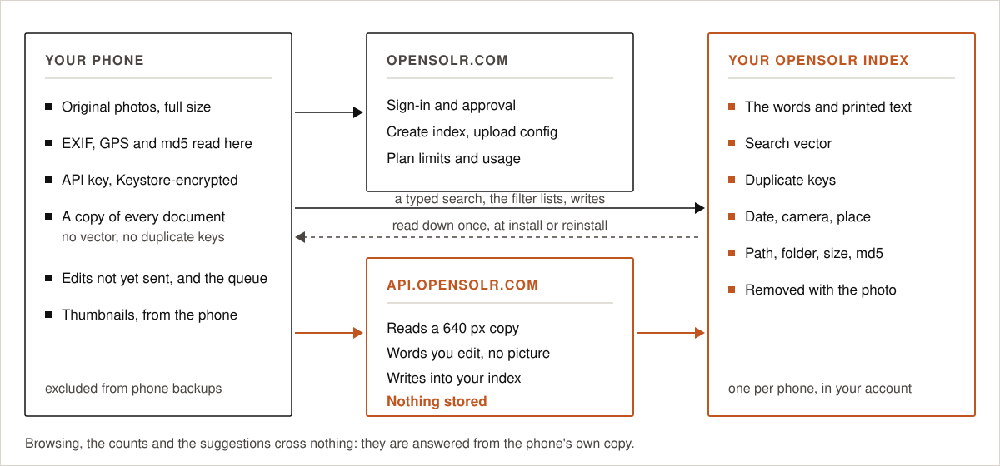

# Privacy and security

  

## What leaves the phone

| Data | Goes to | Kept there? |
|---|---|---|
| A 640 px JPEG copy of each new photo, re-encoded from pixels | api.opensolr.com `image_clip` | No |
| The labels of each photo | api.opensolr.com `batch_embed` | No |
| Your typed searches | api.opensolr.com `embed` (vector search plans), then your index `/select` | Not by the app; the query goes to your own index like any search on it |
| Labels, vector, EXIF fields, path, folder, file name, size | Your Opensolr Index | Yes, until the photo leaves the phone or you empty the index |
| Account email and API key | opensolr.com, with each API call | It is your account |

**Not sent anywhere:** the original files, their EXIF blocks as such, thumbnails, and anything about how you
use the app. The app has no analytics, no advertising, no crash reporting and no third-party SDKs that talk
to the network.

## What stays on the phone

- The API key and the index password, each encrypted with AES-256-GCM under a key generated inside the
  Android Keystore. The key material never leaves the Keystore.
- The photo cache (documents and vectors already paid for), in the app's private storage.
- Settings: chosen folders, schedule, last sync report.

`allowBackup` is off and the data-extraction rules exclude every domain from cloud backup and from
device-to-device transfer. A restored or new phone signs in again.

## Network

- HTTPS only. Cleartext traffic is disabled for the whole app in the network security configuration, and
  only the system's certificate authorities are trusted.
- Redirects are not followed for API calls, so credentials are never re-sent to a host the app did not name.
- Credentials travel in request bodies, never in URLs.
- The index is reached with its own HTTP Basic credentials over HTTPS.

## Sign-in

Browser-based OAuth 2.0 with PKCE; the password is only typed into the browser. See [sign-in](sign-in.md)
for every check made on both sides.

## Queries

What you type is only ever sent to Solr as a bound parameter (`v=$uq`), and every filter value through
`{!term}` with a bound value. No input is spliced into query syntax. See [search](search.md).

## Permissions

| Permission | Why | Required |
|---|---|---|
| Photos (`READ_MEDIA_IMAGES`, or storage on Android 12 and older) | To find and read the photos in your folders | Yes |
| Photo locations (`ACCESS_MEDIA_LOCATION`) | Android removes GPS from photos without it | No, photos are then indexed without a place |
| Approximate location (`ACCESS_COARSE_LOCATION`) | Read once, on the phone, to create the index on the nearest Opensolr environment; never sent | No, the time zone decides instead |
| Notifications | Sync progress and plan alerts | No |
| Internet, network state | Opensolr | Yes |
| Foreground service (data sync) | So Android does not stop a long sync half way | Yes |

The app never writes to, moves or deletes your photos.

## Threat model, briefly

| If someone has… | They can | They cannot |
|---|---|---|
| A sign-in code seen in a URL | Nothing: it needs the verifier, which never leaves the app, and dies after 60 seconds or one use | Get the API key |
| Another app on the phone with the same URL scheme | Receive a code on the fallback path | Redeem it without the verifier |
| A copy of the app's private files | Encrypted blobs | Decrypt them off the phone |
| Your unlocked phone | Use the app like you | Read your Opensolr password |

Report security issues as described in [SECURITY.md](../SECURITY.md).
