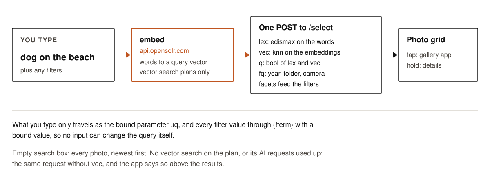

# Search

<p align="center">
  
</p>

There are two paths now. A typed search or a filter goes straight from the app to the phone's index, in
one `POST /select`. Everything else — plain browsing, the suggestions, the lists on the tagging sheet — is
answered on the phone, from its own copy of the index, and reaches nothing.

## The phone's copy of the index

The phone holds a copy of every document its index holds. Everything is in it except the search vector and
the duplicate keys: the id, the path, the file name, the size, the dates, the camera, the EXIF, the place,
the words the photo was read into, the printed text, the people, the owner's tags and the md5 of the file.
It is read from the index **once**, at install or reinstall, and from then on every write keeps it in step.

What that changes on this page:

- **Plain browsing makes no request at all.** The years, the months, the days, their counts and the photos
  inside them all come from the phone.
- **Tag and name suggestions** are answered from the copy, and so is the *already on these photos* list under
  the tagging sheet.
- **The filter lists** are asked for once and then kept until a sync actually writes something.
- Syncing no longer walks the index either; it compares the phone's folders with the copy ([sync](sync.md)).

## The header

The top of the photos screen is one row of small bordered buttons, each an icon with a label, left to right:

| Button | What it does |
|---|---|
| **Opensolr** | The app logo; opens [opensolr.com/admin/solr_manager](https://opensolr.com/admin/solr_manager) in the default browser |
| **Me** | The account screen |
| **Sync** | The Sync screen ([sync](sync.md)) |
| **Stats** | Your library in numbers ([stats](stats.md)) |
| **Map** | The [map](map.md) of the current search |
| **Search** | Opens the search line |

Each thumbnail can carry up to three small marks in its top-right corner, left to right: a pin when the photo
has a location, a person when someone is named on it, and a tag when you tagged it. They step aside while you are
picking photos.

The search box is not on screen until it is asked for: the magnifier opens one compact line with the
filters button on it, and tapping the magnifier again puts it away and clears the query. A query that is in
force keeps the line on screen by itself (`searchOpen || state.query.isNotBlank()`), so coming back from
Stats, duplicates or similar photos shows the words the results answer to instead of only remembering them.

## Empty search box

Every photo, newest first, by `taken_at` and then by id — read from the phone's copy, so nothing is asked
of the index. The grid is grouped under date headings, on three levels: **Year > Month > Day**. *Today*,
*Yesterday* and the weekdays of the last six days still stand above the years: each of them is already a
day. Anything older sits under its year — *2025* — then its month — *September* — and inside the month
its days, *Saturday 5*, *Friday 4*. Every month is spelled out by its days, even a month with a single day
in it.

A bar down the right edge (`FastScroller`) drags the grid: one movement crosses years, with the year and,
under it, the month shown in a badge lifted clear of the thumb. Crossing a heading gives haptic feedback —
the heavier constant for a year, the lighter one for a month — played through the view (`Haptics.tick`),
which needs no VIBRATE permission and obeys the phone's own haptics setting. Days go by in silence: a long
library would buzz without stopping. Its visuals fade when the grid stops, but the strip stays touchable:
gated on the same animation there would be nothing to grab from a standing start.

The bar is a map of the grid's **height**, not of its row count (Cip, 2026-09-20). The map is packed the
way the grid packs — photos fill a line of as many columns as the screen holds, a heading takes a line of
its own and closes the one before it, and a group whose last line is half empty still costs a whole line.
The row heights are learned once, the first time each kind of row is drawn, and held still while a finger
is on the bar; the grid's own top and bottom padding counts towards the travel, so the bar reaches the last
line. Measuring the grid as it moved, or counting a photo as a third of a line, were the two ways this went
wrong: the first made the bar shiver, the second made the bar and the grid disagree about where anything
was as soon as photos were on screen. By row number every row
took the same width on the bar, so a folded group — one row — was as wide as a single photo: with one group
open and forty folded, the forty shared a sliver and a finger could not stop on any of them. Each row now
takes the bar in proportion to how tall it really is (a heading's height for a folded group, a cell's height
per row of photos, measured from what is on screen), the finger lands inside a row rather than on top of it,
and a heading within a few rows of where it points takes it, since what a thumb aims at is a group and not
the third photo inside one.

The grouping is done on the phone in `buildRows`, from `taken_at`, which every hit already carries; it costs
no request. Headings sit on a faint band of the app's accent (`headingBand`: 18% for a year, 11% for a
month, 6% for a day) with the theme's ink on it, so they read as something to tap on light and dark alike
without competing with the photos. A heading folds away with a tap and then says how many it hides, *September (1,480)*; the
expand all / collapse all button on the count line folds or opens every group of the view on screen at once.
What is folded is remembered, across all three levels, so a view comes back the way it was left.
While selecting, a tap on a heading ticks its whole group — a year, a month or a day — and it takes the
whole group, not only the photos loaded so far. The next page is filled in halfway through the last page
shown, so it is usually there before the grid reaches it.

## Typed search

What you type is trimmed to 300 characters and sent **only as the bound parameter `uq`**:

```
uq          = dog on the beach
lexicalRaw  = {!edismax qf="custom_tags_text^5 meaning^2 labels_t^2 ocr_t^3 persons_t^4 text file_name_text folder_text camera_text place_text^1" mm="2<65% 4<50% 8<40%" v=$uq}
```

That is the words-only `qf`. In a hybrid search the lexical leg uses lighter weights, so the meaning leads
and the words refine it: `custom_tags_text^0.5 meaning^0.2 labels_t^0.2 ocr_t^0.4 persons_t^0.3 file_name_text
folder_text camera_text place_text^0.1`.

On a plan with vector search, the app first asks `embed` (with `is_query=1`) for the query's vector and
hands both legs to Opensolr's `{!hybrid}` parser, the one search.opensolr.com runs:

```
vectorQuery = {!knn f=embeddings topK=500}[0.0132, -0.0481, …]
q           = {!hybrid lexical=$lexicalRaw vector=$vectorQuery mode=union alpha=0.8 topN=500}
```

Each leg is scored on its own, normalised per query (BM25 to its maximum, kNN min-max over the candidates)
and blended: `score = alpha * vector + (1 - alpha) * lexical`. `alpha` is `1 - AppPrefs.lexicalWeight`, the
**Semantic ↔ Lexical Balance** slider in Me (0 = meaning only, 1 = words only, default 0.2, so alpha 0.8).
The vector of a typed search is asked for once and then reused for 30 minutes (the last 8 searches are
held, per index): the pages under the first one, the groups of days you open and the suggestions beside the
box all use the same one, since the same words always make the same vector. Before 2.5.2 each of those was
its own `embed` call, counted against the month's AI requests.
No vector is asked for, and the search runs words only, on a plan without vector search, once the month's
AI requests are used up, or for a single character (the embed endpoint refuses it). Nothing about that is
shown on the photos screen; the reasons are in Me.

The photo's own vector is made of one text, built on the server (`Api_lib::_photos_embedding_text`, at
indexing and after an edit), each part only when the photo has it:

```
A together with B, C and D, <sentence without its closing period>, label1, label2, at <town>, <commune>, <province>, <county>, <country>, labeled this as: tag1, tag2
```

One person is just the name; two are `A together with B`; three `A together with B and C`. The sentence is
the image model's reading of the photo, or your own wording when you wrote one. Labels the sentence already
names are not repeated after it, so a model that only names things does not say everything twice.

Without vector search, or when the month's AI requests are used up, or when the vector service does not
answer, the same request runs with `q={!bool should=$lexicalRaw}` and the app says so above the results.
An index still on an older configuration (reset postponed) answers 400 to the newest fields; the app
then retries once without them.

Without vector search on the plan, nothing is sent to be read at all: no photo goes up to be looked at, so
there is nothing the image model read and no printed text. The photo is indexed by its date, its camera, its place, its
file name and the owner's own words, and search is lexical over those.

`meaning` holds what the image model read in the photo: its sentence, or its labels joined when it only names things. `text` also collects the file name, the folder, the camera,
the place and your tags, so *pixel* or *screenshots* find what you would expect.

## The people in a photo

If something has already recognised the faces on your photos — Google Photos, Lightroom, digiKam, Apple
Photos — it writes the names onto the files themselves, in the XMP property `PersonInImage`. The app reads
them from the file and indexes them as `persons_t`, copied into `text`, so typing a name finds that
person's photos.

Nothing recognises faces here: no face is measured, compared or stored, on the phone or on Opensolr. The
names are read the way a file name is read, and a photo that carries none is indexed exactly as before.
Accent folding applies as everywhere else, so a name written with diacritics is found without them and the
other way round.

You can add, change or remove the names yourself in **Edit**, under *People*, or add them to many photos at
once from **Tag** in the selection bar; the names you already use are suggested from the phone's own copy of
the index, so the list is there at once and costs no request. Two spellings of one
name (case, diacritics, spaces: `Words.fold` on the phone, `Api_lib::photos_word_key` on the server) are
kept once. They are written into the
file's XMP (`PhotoReader.writeXmp`, after Android asks once for permission to change the photo), so
any other app sees them too, and into `persons_t` in the index at once. Names outside ASCII are written
as XML character references, which every XMP reader turns back into letters. They are in the phone's copy
of the index as well, so a later read of the photo sends them again.

The names are read on the phone rather than carried on the 1024 px copy: `ExifInterface` converts the XMP
packet to a `String` as ASCII, which turns a name with diacritics into question marks. `PhotoReader
.personsIn` decodes the raw bytes as UTF-8 and the names travel to `photos_ingest` as JSON, in the `persons`
field of the photo.

## Tags written into the photos

Saving tags (Edit, or Tag on a selection) writes them into the file's XMP on the phone, after Android's
write request, twice: as `dc:subject`, the keywords every photo manager shows, and as `opensolr:Tags` in
the app's own namespace (`https://opensolr.com/ns/photos/1.0/`), which other apps neither show nor change.
At indexing only `opensolr:Tags` is read (`PhotoReader.opensolrTagsIn`), so the owner's tags come back after
a reinstall and keywords written by other apps never reach the index. The editor does show the `dc:subject`
keywords of the file, to keep or remove; they go in only when saved. Edit writes exactly the saved list.

### Tag on a selection

The sheet for many photos at once carries *People* first, then *My tags (Albums)*. Each of the two has its
own **Add / Replace** switch:

- **Add** puts the words on top of what each photo already carries.
- **Replace** makes them the whole of that field on every ticked photo, and the sheet says so before you
  save.

Under the form is what the ticked photos already carry — the names and the tags, each with the number of
ticked photos it is on — so you can see what you are about to add to or replace. That list is read from the
phone's copy of the index and costs no request.

The owner's own wording of what a photo shows goes into the file too, as `opensolr:Meaning`, capped at
`PhotoReader.MEANING_MAX_CHARS` (2,000, the same ceiling `photos_ingest` applies). Only a wording the owner
changed is written; what the model read is not, since the server can always produce it again, and *Reset* in
the editor removes the property. Tag on a selection has no wording field: it writes the wording this phone
keeps for a photo, if any, and otherwise leaves the property alone. At indexing the phone's own copy wins,
then `opensolr:Meaning` from the file (`PhotoReader.opensolrMeaningIn`), then the image model.

## The AI switch

Next to the count above the grid, once something is typed. Greyed out and off where search by meaning
cannot run (no vector search on the plan, or no AI requests left this month). On, the search blends meaning
with words (the hybrid query above). Off, the vector leg is left out entirely and the search is purely lexical —
which is what you want for an exact code, a receipt number or a product reference, where the vector
only drags the answer away from the thing you asked for. The same switch search.opensolr.com carries.

## The text printed in a photo

`text` also collects `ocr_t`: the words printed **in** the photo, read on Opensolr's side when a photo
carries any. This is what makes a phone full of paperwork searchable — a gas receipt by the station's
name, the total or its number, an invoice by the company on it, a shelf label by its product code, a
screenshot by what it says, a business card by the person's name. Nothing new to type and nothing to turn
on: the words go into the same field the search already reads, so *chevron*, *invoice 4417* or *oak door*
answer straight away.

On a plan with vector search, every photo is read for printed text, and
unless one of its top 50 labels belongs to the text family (label, document, receipt, invoice, card, ticket,
menu, poster, screenshot, number…) the photo is never sent for reading. A holiday photo costs nothing and
the wedding photos are not shipped anywhere. On a plan without vector search nothing is sent to be read in
the first place: the photo is never read, and `ocr_t` stays empty.

The reading itself happens on Opensolr's OCR servers — Solr machines that do nothing else, never on your
phone — and it does not cost extra: a photo is a tenth of an AI request whether the work was the words, the
vector, the printed text or all three ([plan limits](plan-limits.md)). A photo already read is never read
again, and what was read out of it is never lost: if a later pass cannot read the photo — a plan without
vector search, or the month's AI allowance used up — the printed text and the words already held are kept,
as long as the md5 says it is still the same file.

### How the grid is laid out

The button above the grid chooses the layout, and the choice is kept from one search to the next:
**Best match**, **Date**, **Place**, **People**, **My tags**, **Folder** and **Camera** (browsing with
nothing typed offers all but *Best match*). Folder and camera are one value per photo, so no photo is drawn
twice; photos with neither sit in a last group of their own, *No folder* / *No camera*.

Folders are laid out as the **tree they are**, three levels deep as the date grouping is: *Pictures*, then
*2019* under it, then *11*. A library kept as `2019/11`, `2019/07`, `2024/02` would otherwise come out as a
flat list of *11*, *07* and *02*, which names nothing. A folder holding nothing but one other folder is
written as one line (*Pictures / 2019*); anything deeper than the third level is held by the group at the
bottom; and photos lying directly in a folder that also holds folders get a line of their own under its name.
A camera is its make and model as one name, *Nikon Z6*, with the make left off when the model already begins
with it.

Grouping costs no extra request: a typed search asks for the values it groups by in the same request as the
results (`id,taken_at,city,province,region,country,persons_ss,custom_tags,folder,camera_make,camera_model`),
and browsing reads them from the phone's own copy of the index in one query on its columns — `folder` and
`camera` are columns of that copy, filled from the stored document once, on upgrade.

### When the grid regroups

The grid's grouping follows the **last search that ran**, not the text being typed: typing alone never
regroups the grid. A search runs on Enter, on a picked suggestion, on clearing the box, and on any filter.

After a typed search the results are split into **Best matches** and **Also similar**, at the biggest fall
in score among the results below 60% of the top score. The split is only made with at least 8 results, and
*Best matches* always holds at least 3. The count line shows only *N photos*. Neither of these two headings
carries a group tick while selecting: the line between them moves as more results arrive, so there is no
fixed group to tick.

Suggestion pills above the grid appear only after a typed search; they come from a separate facet request
that returns words only.

## Filters

Every filter is a set of chosen values per field, OR-ed within the field (`{!terms f=year tag=year
separator=| v=$f_year}` with `f_year=2025|2026`) and AND-ed across fields. Values travel as bound
parameters, so no value can change the query. Each field's facet excludes that field's own filter
(`facet.field={!ex=year key=year}year`), so a section keeps offering all its values.

On the filter sheet every tap applies at once. Values are listed alphabetically (years oldest first), up
to 80 per field; long lists show the first twelve with *Show all*. Every group on the sheet carries the same heading the grid gives it, folds away with a tap, and shows
a badge with how many of its own filters are on. All groups are folded when the sheet is first opened, and
what you unfold is remembered between visits. Small **Clear all** and **Done (N)** buttons, where N is the
number of photos shown with the current filters, sit both at the top and at the bottom of the sheet. Active
filters show as removable pills on one horizontally scrolling row.

| Filter | Parameters |
|---|---|
| Year | `fq={!term f=year v=$f_year}` and `f_year=2024` |
| OCR (switch) | `fq=ocr_t:*` when on; off shows every photo |
| Tagged (switch) | `fq=custom_tags:[* TO *]` when on |
| Has people (switch) | `fq=persons_t:*` when on |
| People | `fq={!terms f=persons_ss tag=persons_ss separator=\| v=$f_persons_ss}`: the names, each whole, from the `persons_ss` string field (`persons_t` is analysed text and stays for search) |
| Taken between | `fq={!lucene v=$taken_q}` and `taken_q=taken_at:[2025-07-01T00:00:00Z TO 2025-07-08T23:59:59Z]`. Both days included; the clause travels as one bound parameter, and its two ends are formatted from a Long, so they can only ever be timestamps |
| Camera model | `fq={!term f=camera_model v=$f_camera}` and `f_camera=Pixel 8` |
| City / Country | `fq={!term f=city v=$f_city}` (likewise `country`) |
| My tags | `fq={!term f=custom_tags v=$f_tag}` |
| Meaning | `fq={!term f=labels v=$f_label}` |
| Orientation | `fq={!term f=orientation v=$f_orientation}` (landscape, portrait, square) |
| Has location (switch) | `fq=has_location:true` |
| Within N km | `fq={!geofilt sfield=location pt=$near_pt d=$near_d}` with `near_pt=lat,lon`, `near_d=km` |

*Year* and *Taken between* work together. Choosing years narrows the calendar to those years and opens it
there, instead of on the current month; and once days are chosen, the years are put aside, since the days
already say which years are meant.

The filter sheet is built from facets of the current results (`facet.field` on `year`, `camera_model`,
`city`, `country`, `labels`, `custom_tags`, `orientation` and `persons_ss`; folder, region and camera make
are still indexed and searched by words, but are no longer filters), so
every choice offered has photos behind it. The facets travel only with the first page of a search
(`facet.sort=index`); the pages after it do not ask for them again. The lists are asked for once and then held until a sync actually
writes something, so opening and closing the sheet costs nothing. The radius filter is set from the
[map](map.md) (*Search this area*) or from a photo's *Nearby* (5 km), and adjusted on the sheet (0.5 to
100 km).

## Autocomplete

From the second character, after a 200 ms pause in typing, the app POSTs `suggest.q` to the index's
`/suggest` handler and shows up to eight distinct entries under the search box. The suggester
(`AnalyzingInfixLookupFactory`, dictionary = the stored `suggest` field: your tags, the model's labels, camera
make and model, city, region, province, country) matches anywhere in a term and is rebuilt at every commit.
Tapping a suggestion searches for it.

## Did you mean

A typed search also sends `spellcheck=true` and `spellcheck.q=<text>`. The `/select` handler runs
`DirectSolrSpellChecker` over the `spell` field (tags, labels, file name, camera, places, unstemmed) and
returns a collation; when it differs from what was typed, *Did you mean …?* is shown above the results, one
tap away.

## Results

Pages of 60, loaded as you scroll. Thumbnails are decoded from the photos on the phone; nothing is
downloaded to draw the grid.

- **The buttons above the grid**, left to right: the AI switch (with a query), Filters, Duplicates, the red
  *!* for photos the phone could not read (when there are some), Reload, and Expand / Collapse all. The count
  beside them is compact (`Actions.formatCompact`: 842, 1.2K), and while selecting it reads ✓ and the number.
- **Tap** opens the photo full screen inside the app (`PhotoViewer`), at its own size rather than from the
  thumbnail. It is a `HorizontalPager` over the hits themselves, so a swipe left or right walks the result
  set in its own order — the whole reason it exists: the gallery knows nothing about your search, so
  swiping there walks the camera roll. Nearing the end of what is loaded asks for the next page, so the
  swipe runs as far as the results do. Inside it: a tap shows every action of the photo as a row of icons
  (*Tag*, *Gallery*, *Similar*, *Share*, *Map* and *Nearby* with a GPS position, *Delete*), a swipe up opens
  the details, which carry no buttons — the people first, as chips, then *My tags (Albums)*, then what the
  photo shows as plain text, then the rest of what is known about the file — a swipe down returns to the
  grid — drawn over it, so its scroll position is never disturbed. *Gallery* is `ACTION_VIEW` on the photo's
  MediaStore URI with read permission granted; if the stored id went stale the app finds the photo again by
  its path, and if it is gone from the phone it says so and the next Re-Sync removes it from the index.
  - **Zoom**: pinch with no ceiling, magnifying about the point between the fingers, double tap to magnify
    on the point touched and again to come back, one finger to move a magnified photo about (held inside
    its own edges). Zooming out stops at the whole
    picture — it is not a way to leave. The pager only scrolls while the photo is whole, so a finger on a
    magnified photo belongs to the photo. The pinch loop is written out rather than taken from
    `transformable` or `detectTransformGestures`: both answer a *one*-finger drag as a pan and consume it,
    and the swipe to the next photo dies with them.
  - **Tag** opens the tags over the photo; leaving them puts the photo's details back.
- **Selecting photos**: there is no *Select* button and no *Check all*. A long press on a photo starts
  selection, as every gallery does, and it ends by itself when the last tick goes, or at once with a tap on the ✓ count above the grid, which clears every tick.
  **Keep the finger down after the long press and drag**: every photo between the one it started on and the
  one under the finger is ticked as it travels, dragging back unticks what the drag itself ticked. A drag that
  starts on a photo already ticked works the other way round and unticks the run instead. Near
  the top or bottom edge the grid scrolls itself so the run can pass what is on screen. Headings are skipped
  — a group is taken whole by its own tick. The press is taken by the grid rather than by each photo (a
  photo's own long press ends the instant it fires), in the first pointer pass and consumed from the press
  onwards, so neither the grid's scrolling nor the photo underneath sees the drag; nothing is consumed
  before the press is recognised, so an ordinary tap and an ordinary scroll are untouched. The action is
  still declared in the photo's semantics, for the accessibility services. The bar at the bottom
  works on the ticked photos: **Tag**, **Share**, **Delete**, and **Re-sync N** to have them read again by
  the image model (each counts as new AI requests).
- **A tap you can feel** answers picking photos, crossing a year or a month on the scroll bar, a filter going
  on (firmer) or off (lighter), *Done*, and the next page arriving. `Haptics.tick` plays it through the view
  (`performHapticFeedback`), so it needs no VIBRATE permission and obeys the phone's own setting; one switch
  in Me gates every call site.
- **Reload**: swipe down on the grid, tap the reload icon next to the count, or come back from another
  screen; the results are read again. The swipe and the icon are asked for by hand
  (`AppViewModel.forceRefresh`), so they empty the [search cache](#search-cache) first and always reach
  the index. The swipe down also starts a sync; if a sync is already running it only reloads.
- **Duplicates**: the duplicates icon on the count line switches the grid to groups of alike photos
  ([duplicates](duplicates.md)). Every step of its slider answers with a light tap.
- **Could not be read**: a red icon next to it, only when there are such photos, lists the photos the phone
  itself cannot open or decode (they never reach Opensolr). Each has a red frame, a red *!* and its file name
  with the reason; it opens and selects like any other photo. They are kept in `PhotoCache.skipped` with
  their file size and tried again only when the file changes, or when picked for *Re-sync*.

## Deleting photos

*Delete* always shows the app's own warning first: *Delete N photos? They are removed from this phone and
from your index. This cannot be undone.* On Android 11 and newer the system's own confirmation follows, and
Android does the deleting; on older versions the app deletes what it is allowed to. The deleted photos leave
the results at once and are deleted from the index with an immediate commit, so a refresh does not bring
them back. If that delete fails, the next sync removes them anyway.

## Editing tags and words

*Edit* in the details sheet (`EditSheet.kt`, `EditRepository.kt`) opens the editor at full height:

- **My tags**: one per entry (commas split), removed with a tap. Stored in `custom_tags`; `custom_tags_text`
  is its tokenised copy, first in `qf` with boost 5.
- **Tag suggestions**: focusing the tag field lists suggestions under it. With nothing typed, the 5 most
  used of your tags and the 5 most used of the model's labels; while typing (after a 250 ms pause), up to 8 tags and 5
  words that contain the text anywhere, in any case. They are counted on the phone, from its copy of the
  index, so no request leaves and the list is there as fast as you type. Tags already on the
  photo are not offered, and a word already offered as a tag is not repeated. Tapping a suggestion adds it;
  tapping outside the field and its list closes the list, and tapping the field again reopens it.
- **What the photo shows**: `meaning` as free text; *Reset* empties it, and on *Save* the photo is read again
  (`meaning_reset` on `photos_ingest`): your wording is dropped and the image model's sentence comes back.
- **Save**: the save is local first and finishes on the phone. The edit goes into the cache's `edits` table
  (id → tags, wording) and into the phone's copy of the index, the grid shows it at once, and the sync that
  starts straight afterwards carries it up — 50 photos per call, with no pictures attached, since only the
  words changed, to the `photos_words` endpoint. The server builds the vector again on
  vector plans, from the same text as at indexing (`Api_lib::_photos_embedding_text`). Nothing on screen waits for the network.

Writing the words into the photo files themselves is the one part that still happens on the spot: Android
asks for permission to change the files and a progress bar counts them through.

`SyncEngine.applyEdits` puts the edits over what the model read every time a photo is written again, so the owner's
words always win. After a reinstall the whole copy is pulled down once from the index, so the tags and names
the photos carried are back before anything is edited.

A photo with no date of its own no longer jumps to today when its tags are written into it: the index keeps
the date the photo already had.

## Search cache

What still reaches the index — typed searches, filters and the facets behind them — is kept on the phone
(`data/SearchCache.kt`, its own SQLite file) and reused, so the same question does not spend the plan's
search bandwidth twice. Browsing is not in it at all: browsing never leaves the phone, so there is nothing
to cache. The owner sets the seconds on the
account screen: at least 60, at most a day, 60 by default (`AppPrefs.cacheSeconds`), with a **Clear cache**
button that says how many answers are held. The cache is this phone's own; there is nothing to clear
anywhere else.

The key is the request itself: index name, handler and every parameter with its value, order-independent,
hashed. Two requests share an entry only when the index would answer them identically. At most 400 answers
are kept, the oldest dropped first, and an answer over 700,000 characters is served but not stored. The
answer is stored as the text the index sent, never written out again from the parsed result.

| Cached | Never cached |
|---|---|
| `/select` through `SearchRepository.select`: typed searches and their pages, the facets behind the filters, the documents of duplicate groups, map photos | Writing and deleting (`/update`), the words a sync carries up (`photos_words`), the one-time pull of the phone's copy after an install, and `IndexManager.configVersion`/`hasPhotoSchema` |
| `/suggest`: autocomplete, keyed on the lowercased prefix | |
| The duplicate-group facet, per slider stop (`cachedDuplicateGroups`); the last 4 stops are also held already parsed in memory, so moving the slider back and forth does not read them again | |
| The vector of a typed search, in memory, 30 minutes, the last 8 searches (`SearchRepository.embedOnce`) | |

The uncached paths are uncached on purpose: a write must reach the index as it is, and the one-time pull of
the phone's copy has to be the index's own truth, not an answer held from before.

Everything the app writes clears the cache at once, whatever the seconds say: saving tags
(`saveEdits`), deleting photos, `resetIndex`, and every finished sync (`onSyncFinished`). The deliberate
gestures clear it too: `forceRefresh` (swipe down on the grid, the reload icon).

## Why the request is a POST

A query vector is 1024 numbers, too long for a URL. A POST body also keeps what you search for out of
server access logs.
