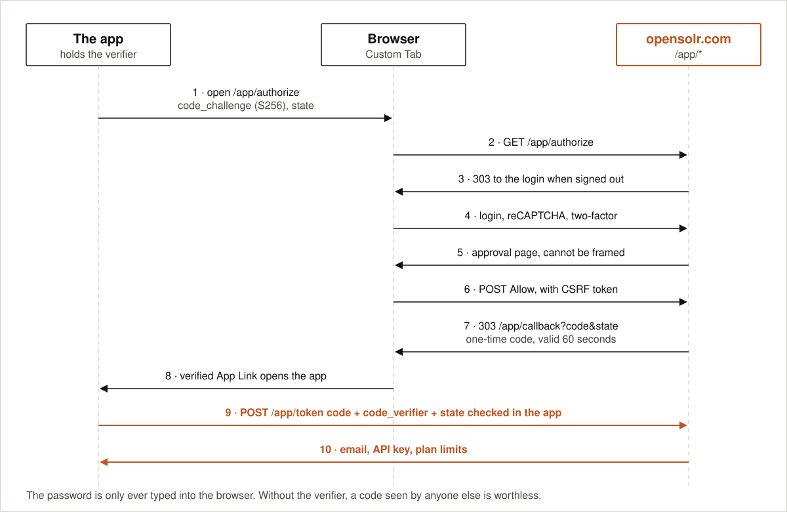

# Sign-in

  

Opensolr Photos signs in the way [RFC 8252](https://www.rfc-editor.org/rfc/rfc8252) says native apps
should: **OAuth 2.0 authorization code flow with PKCE** ([RFC 7636](https://www.rfc-editor.org/rfc/rfc7636)),
with the login page in the phone's real browser.

## Why the browser

The Opensolr login opens in a Chrome Custom Tab, never in a WebView embedded in the app.

- The app cannot see or read anything typed on that page.
- The browser's saved passwords and existing opensolr.com session work. If you are already signed in to
  opensolr.com in the browser, there is nothing to type.
- The login is the normal Opensolr login, with everything it already carries: reCAPTCHA, the per-IP attempt
  limit, the account lockout after failed attempts, and two-factor authentication.

## Step by step

1. **The app prepares.** It generates a random `code_verifier` (48 random bytes, base64url) and a random
   `state` (24 random bytes), stores both encrypted, and computes
   `code_challenge = base64url(SHA-256(code_verifier))`.
2. **The browser opens** `https://opensolr.com/app/authorize` with `response_type=code`,
   `client_id=opensolr-photos`, `redirect_uri=https://opensolr.com/app/callback`, the challenge,
   `code_challenge_method=S256`, the state, and a device label such as *Google Pixel 8* shown on the
   approval page.
3. **opensolr.com checks the request.** `client_id` and `redirect_uri` must equal fixed values exactly,
   the challenge must be 43 base64url characters, the method must be `S256`, the state 16 to 128
   base64url characters. Anything else gets an error page, never a redirect. The valid request is kept in
   the session for 15 minutes.
4. **Login**, if the browser is not signed in to opensolr.com yet.
5. **Approval page.** It says which account is signed in, which phone asks, and exactly what the app will
   do. It cannot be embedded in a frame (`X-Frame-Options: DENY`, `frame-ancestors 'none'`), so it cannot
   be clicked on your behalf, and it is never cached.
6. **Allow** is a POST with the site's CSRF token. A GET never issues a code.
7. **The code.** opensolr.com generates 32 random bytes, stores only their SHA-256 together with the
   account, the client, the redirect URI and the challenge, valid for 60 seconds, and answers
   `303 https://opensolr.com/app/callback?code=…&state=…`. The pages of this flow send no Referer.
8. **Back to the app.** Android opens the app for that URL, because opensolr.com publishes the app's
   signing certificate in [/.well-known/assetlinks.json](https://opensolr.com/.well-known/assetlinks.json)
   (a verified App Link). If Android shows the page instead, it offers a button that hands the same code
   and state to the app through `opensolr-photos://auth`.
9. **The app checks the state** against the one it stored, in constant time, and throws the stored pair
   away whatever the result. A sign-in older than 15 minutes is refused.
10. **The exchange.** The app posts JSON to `https://opensolr.com/app/token`: `grant_type`, `code`,
    `code_verifier`, `client_id`, `redirect_uri`. The server:
    - limits the call to 20 attempts per minute per IP address;
    - marks the code used with one atomic `UPDATE … WHERE used_at IS NULL AND expires_at >= now`, so a code
      can only ever be redeemed once, even by two requests at the same instant;
    - checks `base64url(SHA-256(code_verifier))` against the stored challenge, and the client and redirect
      URI against the stored ones;
    - checks the account is still active;
    - answers the account email, the account API key and the plan limits, with `Cache-Control: no-store`.
      Every refusal is the same opaque `{"status":false,"error":"invalid_grant"}`.

## Who is signed in

The identity is the person actually signed in to opensolr.com in the browser. If that person is visiting
another account through Opensolr Teams, the app still receives **their own** account, never the visited
one.

## What the app keeps

| Value | Where | Protection |
|---|---|---|
| Account email | App preferences | Private app storage |
| Account API key | App preferences | AES-256-GCM with a key held in the Android Keystore |
| Index password | App preferences | AES-256-GCM with the same Keystore key |
| Pending verifier and state | App preferences, 15 minutes at most | Verifier encrypted, both erased on use |

App data is excluded from cloud backup and device-to-device transfer, so a new phone always signs in again.

## When the key stops working

If Opensolr refuses the saved API key (for example after the account's API key was changed), the running
sync stops, a notification says to sign in again, and the app returns to the sign-in screen. Signing in
again is the whole fix: the index and everything in it are still in the account.

## Signing out

Account → Sign out cancels every scheduled sync and forgets the account, the index connection and the photo
cache on the phone. The index stays in your Opensolr account.
