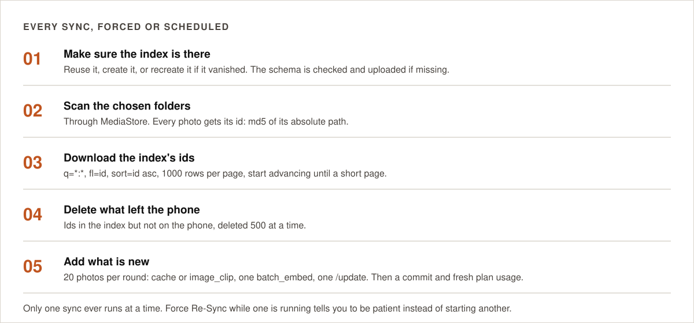
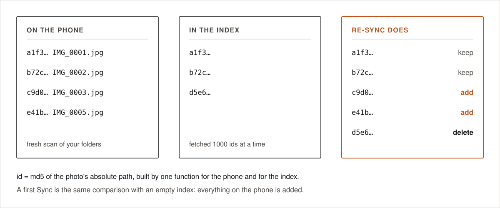

# Sync and Re-Sync

<!-- TODO 2.5: images/sync-flow.svg still draws the pre-2.5 algorithm, where the index was walked. Redraw. -->

  

There is one algorithm. A **first Sync** and a **Re-Sync** only differ in what the phone's own copy of the
index already holds ([below](#the-phones-copy-of-the-index)): the comparison is between your folders and
that copy, on the phone, and a first sync compares against an empty copy, so everything is added.

## The steps

1. **Make sure the index is there** ([below](#the-index)). At install, at reinstall and after a reset this
   also reads the index once into the phone's copy of it. That is the only time the index is walked.
2. **Scan the chosen folders** through MediaStore. MediaStore already leaves out files still being
   written and files in the trash.
3. **Compare, on the phone.** The ids and file sizes found in the folders are held against the phone's copy
   of the index (`PhotoCache.docSizes()`). No request is made, nothing is paged, nothing is downloaded:
   both sides of the comparison are already on the phone. A sync with nothing to do therefore makes **zero
   requests**; before 2.5, a library of 10,000 photos cost about 21 requests and about 1.8 MB on every
   single sync, only to find that nothing had changed.
4. **Delete** every id that is in the phone's copy but not on the phone's storage, 500 per request; the
   copy loses them with the index.
5. **Hand to Opensolr** every photo that the copy does not hold, every photo whose file size or
   modification time differs from the copy's, every photo chosen for *Re-sync selected*, and every photo
   indexed without words while the plan had no AI or while the AI server could not answer. A photo that
   looks touched is weighed exactly before it is read again (once: the md5 worked out here travels with the
   photo if it is sent): the md5 of the file is compared with the md5
   the copy holds, and an equal md5 means only the header was written (your own words, by this app), so
   nothing is read and the copy simply takes the file as it now stands. A photo that comes back without
   words again is left out for a pause that grows each time (1 hour, 4 hours, 16 hours, then once a day;
   kept in the `word_retries` table of `PhotoCache`, cleared by *Re-sync selected*), so it can never keep
   the sync busy. A missing place never sends a photo again: the place is looked up once, when the photo is
   handed over, and a photo whose position has no known place is simply indexed without one. Five per call:
   - make the 640 px copy carrying the original's EXIF, and add the md5 of the original file, and your
     tags, your wording and the people you named on that photo from the phone's edits when there are any;
   - one `photos_ingest` call: the server reads the EXIF, asks CLIP and the embedder, finds the place,
     keeps the tags and words already in the index for photos the phone did not speak for, builds the
     complete document and writes it into your index. A photo the allowance cannot cover is indexed
     without words and read again at a later sync; the printed text and the words it was read into earlier
     are kept, not blanked, as long as it is the same file — the md5 says so.

   On a plan without vector search nothing is sent to be read at all: no 640 px copy is made and no picture
   leaves the phone. Those photos are indexed by date, camera, place, file name and your own words, and
   search is lexical.
6. **Carry up the words** you changed since the last sync — tags, people, wording — through `photos_words`,
   50 photos per call, with no pictures attached, because only the words changed. A sync may consist of
   nothing else. The server reads each document, puts the words in, makes the vector again and writes it
   back; a photo the index does not hold yet goes back in the queue to be indexed whole, picture and all.
   A photo with no date of its own no longer jumps to today when its tags are written into the file: the
   index keeps the date it had.

The server also writes each photo's duplicate keys ([duplicates](duplicates.md)). Both kinds of write are
posted with `commitWithin=10000`, so photos become searchable within about 10 seconds while the sync goes
on, and the phone brings its own copy of the index in step with every write it makes.

A hard commit follows the photos that were read, the words go up after it, and the plan usage is refreshed
at the end. A sync that actually wrote something — photos added or
photos deleted — is also what throws away the held search answers and the cached filter lists
([search](search.md)); a sync that wrote nothing leaves them alone.

<!-- TODO 2.5: images/resync-diff.svg still draws the index side of the diff. Redraw with both sides on the phone. -->

  

## Photo ids

A photo's id is the lower-case hex **md5 of its absolute path**, for example
`md5("/storage/emulated/0/DCIM/Camera/PXL_20260801_101500.jpg")`. It is computed in exactly one place,
`MediaScanner.photoId()`, and used for indexing, for Re-Sync and for the scheduled runs, so the ids on the
phone and in the index are always built the same way.

Consequences worth knowing:

- a photo **moved or renamed** is a new id: the old document is deleted and the photo is added again;
- a photo **edited in place** keeps its id; the sync notices that its size or modification time differs
  from what the phone's copy of the index holds, checks the file's md5 against the copy's, and reads the
  photo again only when the md5 differs too.

## The index

  

- **Found** in the account: its address and password are read and the configuration version the index
  reports (`GET /opensolr-photos-config`, `config_version` in `solrconfig.xml`) is compared with
  `IndexManager.CONFIG_VERSION`. Equal: Re-Sync. Older: the sync stops with `rebuild_required` and the app
  asks the owner first (*Your index will be reset*, Reset and re-sync / Later). Once approved
  (`AppPrefs.rebuildApproved`), the next sync, in this order: keeps as local edits the owner's tags and
  wording that only the index holds, read from the index itself one last time while it still stands
  (`keepOwnersEdits`, so a phone whose copy is incomplete loses nothing), empties the index
  (`delete *:*`) and with it the phone's copy, only **then** uploads the new configuration, and re-syncs
  every photo through `photos_ingest`. Search keeps working while the photos
  are added back. With more than 500 photos and no charger, it waits for the charger before anything is
  emptied. Newer: `update_app`, the index is left alone. Raise both version numbers whenever anything in
  `solr/conf` changes.
- **Not found, this phone never had one, and the account holds photo indexes of other phones:**
  `Outcome.NEEDS_CHOICE`. The app asks *which one of these is your device?* with the phones' names
  (`device_name` from `get_index_list`, sent at `create_index` as maker + model + the phone's own name);
  the pick is stored in `AppPrefs.chosenIndexName` and used from then on, or *none of these* stores the
  phone's own name and creates it. The name is never derived again once chosen.
- **Not found, and this phone never had one:** first setup. The app picks the nearest environment: with the
  optional coarse-location permission, a phone in the Americas (longitude between -170 and -30) gets
  `CHICAGO-96`, everyone else `FINLAND9`; without a position the time zone decides the same way. If the
  chosen environment is not offered, the newest vector environment on the same continent is used. Then it
  creates the index and uploads the configuration.
- **Not found, but this phone had one** (deleted from the control panel, removed as unused, anything):
  created again the same way, and a notification says the index was emptied and is being filled again.

An index is only ever created after the account's index list was **read successfully** and did not contain
it. A network error, a server error or a refused key never lead to a create; they end the run, and the next
sync simply tries again.

## The phone's copy of the index

The phone keeps a copy of every document its index holds, in SQLite, `photo_cache.db`: the id, the path,
the file name, the size, the dates, the camera, the EXIF, the place, the words the photo was read into, the
printed text read out of it (OCR), the people, your own tags, and the md5 of the file. It does not hold the
search vector and it does not hold the duplicate keys ([duplicates](duplicates.md)). The fields are listed
in `EditRepository.CLONE_FIELDS`.

It is read from the index **once** — at install, at reinstall, or after a reset, when
`EditRepository.cloneMissing()` says there is no copy — and only a read that reached the end counts, so an
interrupted one is done again. From then on the copy is kept in step by every write the app makes: each
`photos_ingest` and each `photos_words` answer goes straight into it. A reinstall therefore costs one full
read of the index; after that the index is never walked again.

What it is for, on this page: the diff is local, deletions and re-reads are decided locally, and the md5 it
holds is what lets a later pass keep the printed text and the words of a photo it cannot read. Browsing,
suggestions and the filter lists are answered from the same copy ([search](search.md)).

Beside it the phone keeps your **edits that have not gone up yet** (tags, people and wording per photo,
written the moment you save them) with the queue of what still has to reach the index, the `word_retries`
pauses, and the `skipped` photos the phone could not read.

Editing is local-first and asynchronous. A save is written to the phone — to your edits, to the phone's
copy of the document, and to the queue — and it is finished there; the sync that starts straight after
carries it up through `photos_words`. Writing your words into the photo files themselves (XMP) is a
separate step that happens on the spot, with Android's permission dialog and a progress bar
([search](search.md)).

## When syncs run

| Trigger | Details |
|---|---|
| First setup | Right after the index is created or found |
| Changing folders | Saving a new folder choice starts a sync |
| **Force Re-Sync** | The *Re-Sync* button on the Sync screen |
| **Stop** | Ends the run that is going. `SyncWorker.stopRequested` is checked between batches, because WorkManager cancellation cannot interrupt a batch already uploading; then only the requested runs are cancelled (`NOW`, `LATER`, `CHARGING`, `MEDIA`) — never the periodic work, which would come back with its period elapsed and start a sync on the spot |
| **Re-read** | Button on the Sync screen, with a confirmation that says what it does. Sets `AppPrefs.rereadAllSince` (now minus 10 minutes); every photo whose `indexed_at` is older goes through `photos_ingest` again as if picked for Re-sync. Nothing is emptied and no file is touched; words, place, people and vector are made again, and the owner's tags, names and wording are kept (from the phone, the files, or the index). Which photos those are, and how many, the phone works out from its own copy of the index (`PhotoCache.docsIndexedBefore`); a run that stops carries on where it was, since photos already rewritten are newer than the mark. Cleared when a run finishes |
| **Rebuild OCR documents** | The *Documents* button on the Sync screen, with a confirmation. Nothing is deleted on the server: the phone picks out of its own copy of the index the photos whose words (`meaning`) carry a word of the text family, whole words only, the same rule the server's OCR gate uses (`PhotoCache.docsLikeDocuments`). The OCR filter is narrower: it shows only the photos text was actually read out of, queues them and starts a sync, and each new document takes the old one's place, with the reading cleaned on the way out of the server's cache. Free — a photo read once is never read again |
| **Photos changed** | While the app is alive, a `ContentObserver` on MediaStore images (`AppViewModel.mediaObserver`): 1.5 s after the changes settle, a sync starts if one of them is in your folders. When the app is not running, `SyncScheduler.watchMedia`: a WorkManager content-URI trigger, 60 s after the first change and at most 5 min later; one-shot by design, re-armed after every run and at every app start. A change that cannot be placed in a folder (a deleted photo) is checked against `MediaScanner.folderStamp`: the count of photos in your folders and the latest MediaStore write among them, one query, compared with the stamp of the last finished sync |
| **Back to the app** | `MainActivity.onResume` compares the same folder stamp; a sync starts only if it differs, so an edit made while Android had closed the app is still picked up |
| **Re-sync selected** | Chosen photo ids go to `AppPrefs.resyncIds` and a sync starts; those photos are read and written again whatever the phone's copy of the index says about them, and their word pauses and *could not be read* marks are cleared |
| **Pull the photo grid down** | Reloads the grid and starts a sync as well; ignored if a sync is already running |
| **Kind to the battery** | The watch only starts a sync when a changed picture is in one of your folders; a screenshot or a chat picture elsewhere is ignored without a single request. Two watch-started syncs stay at least 15 minutes apart (the change waits, it is not lost). More than 500 photos to read at once waits for the charger. The app paces its calls under your account's API rate limits, and if Opensolr still asks it to slow down, the run stops and is started again a little later instead of waiting with the phone awake. |
| **Scheduled** | Every day, week or month, your choice on the Sync screen; the safety net for what the watcher cannot see (words after the allowance resets or a pause ends, an index changed on the server); only with a network connection and a battery that is not low |

**Only one sync runs at a time.** Both kinds are unique WorkManager jobs, and the worker also refuses to
start while another sync runs in the same process. Pressing *Re-Sync* while a sync is queued or running
shows *A sync is already running* and starts nothing.

While a sync runs it is a foreground data-sync job with a progress notification. The top bar of the photo
grid shows a turning sync icon; tapping it opens the Sync screen with the phase and the count.

## When a run stops early

| Situation | What the app does |
|---|---|
| The phone cannot open or decode a photo | Skips it, remembers it with its file size (`PhotoCache.skipped`) and does not try it again until the file changes or it is picked for *Re-sync*; the Photos screen lists it under the red *could not be read* icon |
| The server refuses a photo | Skips that photo, counts it as skipped, continues; tried again at the next sync |
| Rate limit (per minute or per hour) | Waits as long as the server says, retries up to six times |
| Monthly AI requests used up | Carries on: from the first refused request, photos are written without CLIP words and without vectors (`quotaHit`) and so without `clip_model`; the phone finds them again in its own copy of the index (`PhotoCache.docsWithoutWords`) and puts them into the first sync after the allowance is back. A photo that had already been read keeps its printed text and its words, matched to the file by md5. The report says how many, with a notification |
| Index over its disk space or bandwidth (HTTP 403) | Stops, notification with a link to pricing |
| No vector search on the plan | Nothing is sent to be read: no 640 px copy is made and no picture leaves the phone. Photos are indexed by date, camera, place, file name and your own words, and search is lexical. A photo read on an earlier plan keeps its printed text and its words, matched to the file by md5 |
| Index password changed | Reads the new one from the account, retries once |
| API key refused | Stops, asks you to sign in again |
| Anything else | Commits what was written, stops; the next sync continues from where this one got to |

A run never has to start over: the next Re-Sync compares ids again, against the phone's copy of the index,
and only adds what is still missing. Words saved but not yet carried up stay in the queue and go with the
next sync.

## The Sync screen

- **Status**: running with phase and progress, waiting for network, or the outcome of the last run.
- **Last sync**: what the run did (*3 synced · 1 removed*) for a few seconds after it finishes, then the
  finish time (mm/dd/yyyy hh:mm:ss), the result, the photos in your folders, the photos in your index as
  they are now (`indexAfter`), and a note if the index had to be recreated.
- **Re-Sync**, **Stop** (only while a run is going), **Re-read**, **Documents** (reads the receipts, labels
  and screenshots again) and **Reset**, in one row, with a line under it saying what each of them does.
- **Automatic Re-Sync**: every day, every week or every month.
- **Folders being indexed**, and Change folders.
